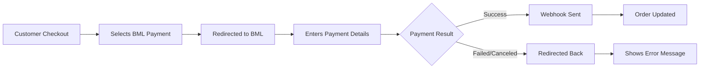

<div align="center">

# Bank of Maldives Payment Gateway for WooCommerce

[](https://dbad-license.org)
[](https://wordpress.org/)
[](https://woocommerce.com/)
[](https://php.net/)

A third-party WooCommerce payment gateway plugin for integrating Bank of Maldives (BML) payment services.

Developed by

<a href="https://wdm.mv"></a>

</div>

---

## Disclaimer

**This is a third-party plugin and is not affiliated with, endorsed by, or sponsored by Bank of Maldives (BML).**

This is an independent community-developed integration created by WDM. It's provided as-is, free of charge, to help merchants integrate BML payments with WooCommerce.

**A few things to keep in mind:**

- Please test thoroughly in a staging environment before using in production
- You'll need your own BML merchant account and API credentials
- We recommend keeping your site secure and monitored
- This plugin is open source and community-driven

**Contributions Welcome!**

Found a bug? Have a feature idea? Want to improve the code? We'd love your help!

- **Report Issues:** [GitHub Issues](https://github.com/wdmv/woocommerce-bml-gateway/issues) - Bug reports, feature requests, or questions
- **Pull Requests:** Feel free to submit PRs with improvements or fixes
- **Feedback:** Your experience helps make this plugin better for everyone

---

## Features

| Feature                 | Description                                                         |
| ----------------------- | ------------------------------------------------------------------- |
| Secure Payments         | Built with security in mind, handling sensitive payment data safely |
| HPOS Compatible         | Fully compatible with WooCommerce High-Performance Order Storage    |
| Checkout Blocks Support | Works with WooCommerce Checkout Blocks (block-based checkout)       |
| Test Mode               | Built-in test mode for development and testing                      |
| Webhook Handling        | Reliable server-to-server webhook processing                        |
| Auto-Capture            | Supports automatic payment capture functionality                    |

## Requirements

- WordPress 5.8 or higher
- WooCommerce 6.0 or higher
- PHP 7.4 or higher

---

## Installation

### Via WordPress Admin

1. Download the plugin ZIP file
2. Go to **Plugins > Add New** in your WordPress admin
3. Click **Upload Plugin**
4. Select the ZIP file and click **Install Now**
5. Activate the plugin

### Via FTP/SFTP

1. Upload the `bml-gateway` folder to `/wp-content/plugins/`
2. Go to **Plugins > Installed Plugins**
3. Find **Bank of Maldives Payment Gateway**
4. Click **Activate**

---

## Configuration

> **Before configuring:** You must have a valid BML merchant account and API credentials. Contact Bank of Maldives directly to apply for payment gateway integration. This plugin does not provide BML merchant accounts or API credentials.

### Step 1: Access Payment Settings

1. Navigate to **WooCommerce > Settings**
2. Click on the **Payments** tab
3. Find **Bank of Maldives** in the payment gateways list

### Step 2: Enable the Gateway

1. Click the **Manage** button next to Bank of Maldives
2. Toggle **Enable** to **ON**
3. Click **Save changes**

### Step 3: Configure Gateway Settings

| Setting            | Description                                                         |
| ------------------ | ------------------------------------------------------------------- |
| **Enable/Disable** | Turn the payment gateway on or off                                  |
| **Title**          | Payment method name shown at checkout (default: "Bank of Maldives") |
| **Description**    | Description shown to customers during checkout                      |
| **Merchant ID**    | Your BML merchant ID (obtained from BML)                            |
| **API Key**        | Your BML API key (obtained from BML)                                |
| **API Secret**     | Your BML API secret (obtained from BML)                             |
| **Test Mode**      | Enable for testing with BML sandbox                                 |
| **Auto-Capture**   | Automatically capture payments after authorization                  |

### Step 4: Save Your Settings

Click **Save changes** after configuring all options.

---

## How It Works



### Payment Flow

1. **Customer Checkout** - Customer adds items to cart and proceeds to checkout
2. **Selects BML** - Customer selects Bank of Maldives as payment method
3. **Redirect to BML** - Customer is securely redirected to BML's payment page
4. **Payment Processing** - Customer enters card details on BML's secure page
5. **Webhook Notification** - BML sends a server-to-server webhook to your store with payment status
6. **Order Update** - Order is automatically updated based on payment status
7. **Customer Return** - Customer is redirected back to your store with order confirmation

---

## Usage at Checkout

### For Your Customers

When customers reach the checkout page:

1. They will see **Bank of Maldives** listed as a payment option
2. After clicking **Place Order**, they are redirected to BML's secure payment page
3. They enter their card details and complete the payment
4. Once complete, they are redirected back to your store with:
   - **Success** - Order confirmation page
   - **Failure** - Error message with option to try again

### Order Management

Paid orders are marked with the following statuses:

| Status         | Description                            |
| -------------- | -------------------------------------- |
| **Processing** | Payment successfully captured          |
| **On Hold**    | Payment authorized but pending capture |
| **Failed**     | Payment was declined or failed         |
| **Cancelled**  | Payment was cancelled by customer      |

---

<details>
<summary><strong>Development Environment Setup</strong> (Click to expand)</summary>

### Prerequisites

- Docker
- Docker Compose
- Make (optional, for convenience commands)

### Quick Start

1. **Start the development environment:**

```bash
docker-compose up -d
```

2. **Access WordPress:**

- WordPress Admin: http://localhost:8080/wp-admin
- Username: `admin` (you'll set this on first install)
- Password: (set during installation)

3. **Access phpMyAdmin:**

- URL: http://localhost:8081
- Server: `db`
- Username: `root`
- Password: `rootpassword`

4. **Access MailHog** (for email testing):

- URL: http://localhost:8082

### Initial WordPress Setup

1. Visit http://localhost:8080
2. Select your language
3. Fill in site information:
   - Site Title: `BML Gateway Dev`
   - Username: `admin`
   - Password: (your choice)
   - Email: `admin@example.com`
4. Complete the installation

### Install WooCommerce

1. Go to **Plugins > Add New**
2. Search for **WooCommerce**
3. Click **Install Now** and then **Activate**
4. Follow the WooCommerce setup wizard

### Activate BML Gateway Plugin

The plugin is automatically mounted at `wp-content/plugins/bml-gateway/`.

1. Go to **Plugins > Installed Plugins**
2. Find **Bank of Maldives Payment Gateway**
3. Click **Activate**

### Docker Services

| Service    | URL                   | Description                |
| ---------- | --------------------- | -------------------------- |
| WordPress  | http://localhost:8080 | Main WordPress site        |
| phpMyAdmin | http://localhost:8081 | Database management        |
| MailHog    | http://localhost:8082 | Email testing              |
| MySQL      | localhost:3307        | Direct database connection |

### Database Connection

- Host: `localhost`
- Port: `3307`
- Database: `bml_gateway_dev`
- Username: `wordpress`
- Password: `wordpress`

### Development Commands

```bash
# Start containers
docker-compose up -d

# Stop containers
docker-compose down

# View logs
docker-compose logs -f wordpress

# Restart WordPress
docker-compose restart wordpress

# Access WordPress container
docker-compose exec wordpress bash

# Clear all data (reset)
docker-compose down -v
```

### Plugin Development

The plugin files are located in the `plugin/` directory. Changes to these files are immediately reflected in the WordPress container.

```
plugin/
├── bml-gateway.php                 # Main plugin file
├── includes/
│   ├── class-bml-gateway-payment-gateway.php  # Gateway class
│   └── class-bml-gateway-blocks.php           # Blocks support
└── assets/
    ├── css/                        # Stylesheets
    ├── js/                         # JavaScript files
    └── images/                     # Logos and icons
```

### Testing

1. Create a test product in WooCommerce
2. Add to cart and proceed to checkout
3. Select **Bank of Maldives** as payment method
4. Complete the checkout process

</details>

---

## Troubleshooting

### Issue: Orders not updating after payment

**Solution:** Check that your webhook endpoint is accessible:

- Webhook URL: `https://yoursite.com/bml-gateway/webhook`
- Ensure your server can receive POST requests from BML
- Check WooCommerce > Status > Logs for any errors

### Issue: Gateway not showing at checkout

**Solution:**

1. Verify WooCommerce is active
2. Check the gateway is enabled in WooCommerce > Settings > Payments
3. Ensure your store's currency is supported by BML
4. Clear your cache

### Issue: Webhook verification failing

**Solution:**

1. Verify your API Secret is correct
2. Check that Test Mode matches your BML account environment
3. Ensure your server clock is synchronized (NTP)

---

## Security

- All sensitive data is encrypted before storage
- Webhook signatures are verified for authenticity
- Supports HTTPS only in production
- PCI DSS compliant through BML's hosted payment page

---

## Support

| Resource             | Link                                                                    |
| -------------------- | ----------------------------------------------------------------------- |
| **Developer**        | [WDM](https://wdm.mv)                                                   |
| **BML Official**     | [bml.com.mv](https://www.bankofmaldives.com.mv) (for merchant account)  |
| **WooCommerce Docs** | [docs.woocommerce.com](https://docs.woocommerce.com/)                   |
| **Report Issues**    | [GitHub Issues](https://github.com/wdmv/woocommerce-bml-gateway/issues) |

> **Note:** For issues related to your BML merchant account or API credentials, please contact Bank of Maldives directly. This plugin is not supported by BML.

## Changelog

### 1.0.0

- Initial release
- BML payment gateway integration
- Webhook handling for payment notifications
- HPOS compatibility
- Checkout blocks support
- Test mode functionality

---

## License

DBAD (Don't Be A Dick) License - [dbad-license.org](https://dbad-license.org)

This plugin is free to use, modify, and distribute. Just don't be a dick about it.

---

## Warranty & Liability

**NO WARRANTY:** This plugin is provided "as is" without warranty of any kind, express or implied, including but not limited to the warranties of merchantability, fitness for a particular purpose, and non-infringement.

**LIMITATION OF LIABILITY:** In no event shall WDM or Bank of Maldives be liable for any direct, indirect, incidental, special, exemplary, or consequential damages (including, but not limited to, procurement of substitute goods or services; loss of use, data, or profits; or business interruption) however caused and on any theory of liability, whether in contract, strict liability, or tort (including negligence or otherwise) arising in any way out of the use of this software, even if advised of the possibility of such damage.

---

<div align="center">

Made with 💛 by <a href="https://wdm.mv">WDM</a>

</div>
